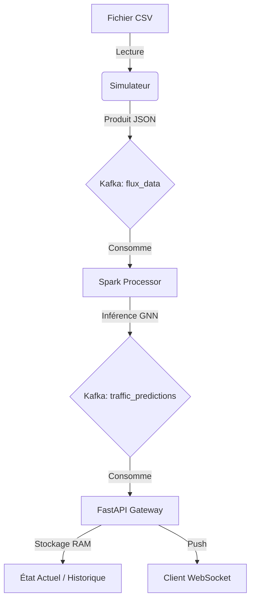

# ⚙️ Architecture Détaillée du Backend

Ce document présente l'architecture technique du backend, conçue comme un pipeline de données en temps réel suivant le paradigme de l'**Architecture Kappa**. L'objectif est de transformer un flux brut de données de capteurs de trafic en prédictions exploitables via un processus de streaming distribué.

## Composants du Système

### 1. Simulateur de Trafic (`mini-services/simulator`)
Le simulateur agit comme une abstraction des capteurs physiques installés aux intersections urbaines.
- **Mécanisme d'Ingestion** : Le simulateur lit des données historiques provenant du fichier `data/test.csv`. 
- **Flux de Données** : 
  - Le moteur parse le CSV ligne par ligne.
  - Pour chaque enregistrement, il génère un payload JSON contenant l'identifiant de l'intersection (`Junction`), l'horodatage (`DateTime`) et le volume de véhicules (`Vehicles`).
  - Ces événements sont produits vers le topic Kafka `flux_data`.
- **Contrôle Temporel** : L'implémentation inclut un paramètre `STREAM_DELAY` permettant de simuler différents régimes temporels (temps réel strict ou accélération temporelle pour les tests de stress).

### 2. Bus d'Événements : Apache Kafka
Kafka sert de colonne vertébrale au système, assurant le découplage total entre la production et la consommation de données.
- **Topic `flux_data`** : Flux d'entrée contenant les mesures brutes.
- **Topic `traffic_predictions`** : Flux de sortie contenant les résultats d'inférence du modèle Spark.
- **Rôle Académique** : L'utilisation de Kafka garantit la persistance des données, la tolérance aux pannes et la capacité de rejouer des flux de données pour valider des modèles de prédiction.

### 3. Processeur de Streaming : Apache Spark (`mini-services/spark`)
Le "cerveau" analytique du système, effectuant l'inférence ML en temps réel.
- **Modèle Prédictif** : Utilisation d'un **GNN (Graph Neural Network)**  `TrafficGNN`  implémenté via PyTorch (`gnn_model.pth`, 102k paramètres) avec normalisation par scaler Scikit-Learn (`scaler_y.pkl`).
- **Logique de Traitement** :
  - **Fenêtrage (Windowing)** : Spark agrège une fenêtre glissante de 24 pas de temps par intersection.
  - **Features (14 dimensions)** : Encodages cycliques (heure, jour, mois), lags (1, 2, 3, 24), moyennes mobiles (6, 24), différence première.
  - **Inférence** : Le GNN propage les informations entre les 4 junctions (GCNConv) et prédit le flux futur.
  - **Production** : La prédiction est encapsulée et envoyée vers le topic `traffic_predictions`.
- **Technologie** : PySpark Structured Streaming opérant en mode local pour l'optimisation des ressources.

### 4. Passerelle API : Backend Gateway (`mini-services/api`)
Une interface haute performance basée sur FastAPI faisant le pont entre le monde distribué de Kafka et le client Web.
- **Gestion de l'État en Mémoire** : Pour minimiser la latence, l'API maintient un état actuel (`current_state`) et un historique récent (`history`) via des structures de données optimisées (`deque`). Cela élimine le besoin d'interroger une base de données disque pour chaque mise à jour visuelle.
- **Consommation Asynchrone** : Un thread d'arrière-plan écoute en continu le topic `traffic_predictions`.
- **Protocoles de Diffusion** :
  - **REST API** : Pour la récupération de l'état initial et des historiques.
  - **WebSockets** : Pour le push temps réel des prédictions vers le frontend.

## Schéma de Flux Backend

##  Spécifications Techniques
- **Langage** : Python 3.11+
- **Framework** : FastAPI
- **Streaming** : Apache Kafka & PySpark
- **Apprentissage Profond** : PyTorch (TrafficGNN  GCNConv)
- **Conteneurisation** : Docker (Multi-stage build pour optimiser la taille des images)

## Résilience et Robustesse
- **Mécanisme de Wait-for-Kafka** : L'API et le Simulateur implémentent une logique de tentative (retries) pour éviter le crash système si Kafka n'est pas encore totalement opérationnel au démarrage.
- **Flexibilité d'Authentification** : Support natif du mTLS (pour Aiven Cloud) et du mode Plaintext (pour le développement local Docker).
