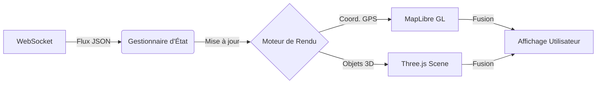

# 🎨 Architecture Détaillée du Frontend

Ce document décrit la conception et l'implémentation de l'interface utilisateur, un tableau de bord interactif haute performance dédié à la visualisation du flux de trafic urbain en 3D.

## 🏗️ Architecture Logicielle

### 1. Framework de Base (Next.js 15)
L'application repose sur **Next.js 15** utilisant l'App Router.
- **Stratégie de Rendu** : Approche hybride utilisant des *Server Components* pour la structure globale et des *Client Components* pour la partie interactive et la carte.
- **Design System** : Utilisation de Tailwind CSS pour une esthétique de type "Centre de Commandement" (Dark Mode), optimisée pour la lisibilité des données critiques.

### 2. Moteur de Visualisation (MapLibre GL + Three.js)
L'innovation majeure réside dans la fusion d'une carte géospatiale 2D et d'un moteur de rendu 3D.
- **MapLibre GL** : Gère la couche de base, les projections cartographiques, les niveaux de zoom et le rendu des vecteurs routiers.
- **Intégration Three.js** : Un overlay 3D synchronisé avec la caméra de la carte. Ce moteur permet de projeter des objets 3D (véhicules, flux) sur des coordonnées géographiques réelles.
- **L'Animateur de Flux (Car Animator)** :
  - Chaque intersection est liée à un segment de route.
  - La densité et la vitesse des véhicules 3D sont modulées dynamiquement en fonction des valeurs de prédiction reçues de l'API.
  - Un système de "traînées" (trails) est utilisé pour visualiser l'intensité du trafic.

### 3. Gestion du Flux de Données Temps Réel
Pour maintenir un taux de rafraîchissement de 60 FPS sans geler l'interface, une gestion rigoureuse du flux est mise en place.
- **Client WebSocket** : Maintient une connexion persistante avec la passerelle FastAPI.
- **Réactivité d'État** : Lorsqu'une prédiction arrive, seule la portion de la scène 3D concernée (le segment de route spécifique) est mise à jour, évitant ainsi un re-rendu complet de la carte.
- **Tampon de Données (Buffering)** : Les prédictions sont stockées dans une queue et traitées durant la boucle d'animation Three.js pour garantir une fluidité parfaite.

### 4. Composants d'Interface (UI)
- **Dashboard de Trafic** : Panneau latéral affichant les métriques en direct, l'état des intersections et la santé globale du système.
- **Analyse de Prédiction** : Affichage des courbes de tendances et des volumes prédits par le modèle **TrafficGNN** (voir [GNN.md](./GNN.md)).
- **Interactivité** : Possibilité de zoomer sur des zones spécifiques pour observer la simulation 3D de près.

## 📊 Flux de Rendu Frontend

## 🛠️ Stack Technique
- **Framework** : Next.js 15 (React)
- **Langage** : TypeScript (pour la robustesse du typage des données de trafic)
- **Cartographie** : MapLibre GL
- **Rendu 3D** : Three.js
- **Stylisation** : Tailwind CSS
- **Iconographie** : Lucide React

## 📈 Optimisations de Performance
- **Build Standalone** : Utilisation du mode `standalone` de Next.js pour réduire la taille de l'image Docker et la consommation mémoire.
- **Accélération Matérielle** : Tout le rendu 3D est déporté sur le GPU via WebGL.
- **Mises à jour Ciblées** : Utilisation d'un graphe de scène optimisé dans Three.js pour ne modifier que les propriétés de transformation des objets impactés.
