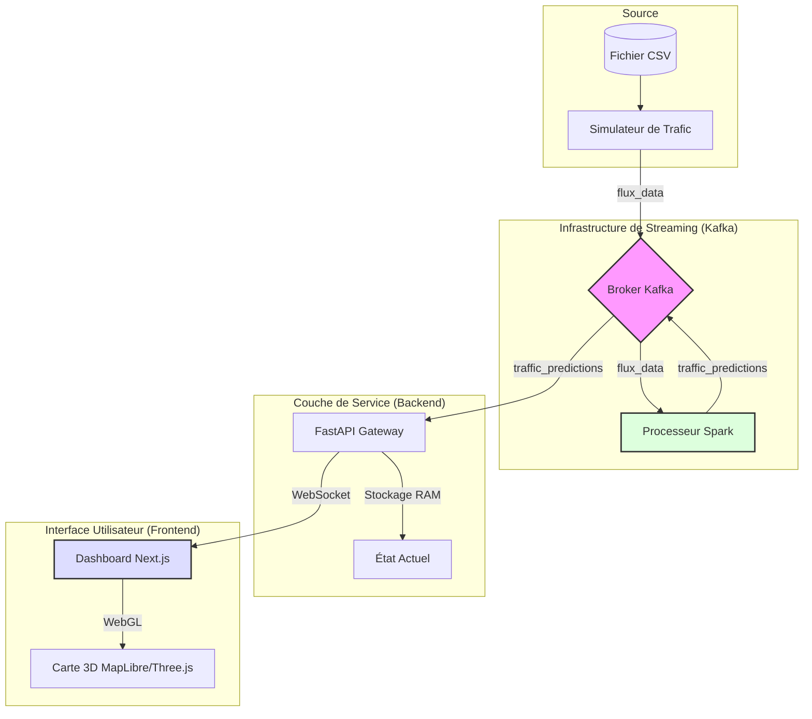

# 🔄 Intégration Système et Flux de Données

Ce document décrit l'interconnexion des différents modules du projet et analyse le cycle de vie d'une donnée, depuis sa source brute jusqu'à sa représentation visuelle finale.

## 🌊 Le Pipeline de Données End-to-End

Le système suit un flux linéaire et asynchrone, optimisé pour le traitement en temps réel. Le cheminement d'une donnée peut être résumé comme suit :

`[Fichier CSV]` $\rightarrow$ `[Simulateur]` $\rightarrow$ `[Kafka: flux_data]` $\rightarrow$ `[Processeur Spark]` $\rightarrow$ `[Kafka: traffic_predictions]` $\rightarrow$ `[API Gateway]` $\rightarrow$ `[WebSocket]` $\rightarrow$ `[Interface UI]`

### 1. Production des Données (Le Simulateur)
Le cycle commence par l'ingestion de données historiques. Le simulateur transforme des enregistrements statiques en un flux d'événements dynamiques.
- **Action** : Lecture d'une ligne du fichier `test.csv`.
- **Transformation** : Conversion du format CSV en objet JSON standardisé.
- **Transport** : Envoi via le protocole TCP vers le broker Kafka.

### 2. Traitement et Inférence (Apache Spark)
Spark agit comme l'unité de calcul distribué. Il ne se contente pas de transmettre la donnée, il lui ajoute une valeur prédictive.
- **Agrégation** : Spark consomme le flux `flux_data` et regroupe les données par `JunctionID` sur une fenêtre temporelle glissante.
- **Analyse** : Le vecteur de données (14 features) est passé au modèle **TrafficGNN** (Graph Neural Network avec GCNConv) qui analyse la saisonnalité, la tendance et les relations spatiales entre les 4 junctions.
- **Résultat** : Une prédiction numérique est générée et produite vers le topic `traffic_predictions`.

### 3. Pont de Communication (FastAPI Gateway)
L'API Gateway sert de traducteur entre le monde du Big Data (Kafka) et le monde du Web (HTTP/WS).
- **Consommation** : L'API écoute en permanence les prédictions de Spark.
- **Mise en Cache** : La dernière prédiction pour chaque intersection est stockée en RAM pour permettre un chargement instantané lors de l'ouverture de la page.
- **Diffusion** : L'API utilise le protocole WebSocket pour "pousser" (push) la donnée vers le frontend dès qu'elle est reçue, sans que le client ait besoin de demander la mise à jour.

### 4. Visualisation Finale (Frontend)
Le frontend transforme la donnée numérique en une expérience visuelle.
- **Réception** : Le client Next.js reçoit le payload JSON via WebSocket.
- **Projection** : L'ID de l'intersection est converti en coordonnées GPS.
- **Animation** : Le moteur Three.js ajuste la vitesse et la densité des voitures 3D pour refléter le volume prédit.

## 📊 Schéma Global d'Architecture



## 📋 Spécifications des Formats de Données

Pour un usage académique, voici la structure exacte des messages transitant dans le système :

### Événement d'Entrée (Topic: `flux_data`)
Ce message représente une mesure brute prise par un capteur.
```json
{
  "Junction": 1,
  "DateTime": "2017-01-01 00:00:00",
  "Vehicles": 12
}
```

### Événement de Prédiction (Topic: `traffic_predictions`)
Ce message représente le résultat de l'inférence du modèle TrafficGNN.
```json
{
  "DateTime": "2017-03-11 09:00:00",
  "Junction": 1,
  "Vehicles": 42,
  "PredictedVehicles": 38.5,
  "Status": "moderate",
  "Timestamp": "2026-06-12T14:00:00+00:00"
}
```

## ⏱️ Analyse de la Performance
- **Latence de Bout en Bout** : Le délai moyen entre la simulation d'un véhicule et sa visualisation sur la carte est estimé à $< 500\text{ms}$.
- **Débit** : Grâce à l'asynchronisme de Kafka et aux WebSockets, le système peut supporter des milliers de mises à jour par seconde sans dégrader la fluidité de l'interface (maintien des 60 FPS).
